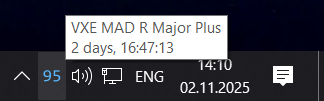

# Mouse Tray Charge

[English](README.md) | **Русский**

**Универсальный** индикатор заряда беспроводной мыши в системном трее Windows.
Одно приложение, много производителей — добавление нового вендора или модели —
это один небольшой файл, без изменений в UI и коде опроса.



## Как это работает

Любая мышь, независимо от производителя, сводится к одной нормализованной
структуре [`BatteryStatus`](mouse_tray/battery.py) — `present / percent /
charging / full / asleep`. Единый конечный автомат в
[`ui/app.py`](mouse_tray/ui/app.py) превращает её в значок трея (цифры, анимация
зарядки, уведомление о полном заряде, тултип «время с последней полной
зарядки»). Код вендора делает всего две вещи: **находит устройство** и
**разбирает его отчёт о батарее**.

```
mouse_tray/
  battery.py            BatteryStatus — универсальная модель статуса
  config.py             настройки (интервал опроса, цвета, шрифт)
  resources.py          пути к ресурсам, совместимые с PyInstaller
  storage.py            дата «последней полной зарядки» (реестр Windows)
  drivers/
    driver.py           MouseModel, MouseDriver, @register + реестр
    hid.py              HidDriver — общая база на одну транзакцию (hidapi)
    hidpp.py            HidppDriver — многошаговая база HID++ (Logitech)
    nordic52.py         Compx/Nordic 52840 (HID write/read, отчёт 8, 17 байт)
    nordic54.py         Compx/Nordic 54L15 (HID write/read, отчёт 8, 64 байта)
    ninjutso.py         Ninjutso Sora     (HID feature-отчёт 5)
    razer.py            Razer             (HID feature-отчёт 0, OpenRazer)
    realtek.py          MCHOSE / RealTek  (push-отчёт 0x13, XOR 0xFF)
    lamzu.py            Lamzu             (HID feature-отчёт, iface 2)
    logitech.py         Logitech          (HID++ 2.0 через приёмник)
    attackshark.py      Attack Shark      (входящий HID-отчёт 3, push)
    __init__.py         авто-импорт драйверов -> реестр заполняется
  ui/
    icons.py            отрисовка значка трея (PIL-текст + .ico)
    tray.py             обёртка над TaskBarIcon
    app.py              wx-приложение + единый автомат состояний
  icons/                встроенные .ico-ресурсы
```

## Запуск из исходников

```sh
uv sync
uv run python main.py        # или:  uv run python -m mouse_tray
```

## Сборка автономного .exe

```sh
uv run --extra build python tools/make_release.py
# -> dist/mouse_tray/
```

## Как добавить новую мышь

**Тот же вендор, новая модель** — добавьте строку в список `models` драйвера:

```python
# drivers/nordic52.py
_model("VXE NewModel", 0x373B, 0x1234, 0x5678),
```

> Драйвер `nordic52` покрывает общий **чипсет Compx/Nordic 52840**, а не только
> ATK/VXE/VGN. Многие «ноунейм»-мыши на том же кремнии (ресивер определяется как
> «Compx») заводятся одной строкой `_model` с их VID/PID — без нового драйвера.
> Zaopin Z2 Mini и Scyrox V8 добавлены именно так; если процент читается в байте
> 6 ответа на отчёт 8 — это тот самый протокол. Более новый кремний Nordic 54L15
> (ATK Zero) использует другой 64-байтный протокол и живёт в `nordic54`.

**Новый вендор** — создайте `drivers/<vendor>.py`, унаследуйте `HidDriver`,
перечислите модели и реализуйте `read_status()`:

```python
from ..battery import BatteryStatus
from .driver import MouseModel, register
from .hid import HidDriver

@register
class AcmeDriver(HidDriver):
    vendor = "Acme"
    models = [MouseModel("Acme X1", 0xABCD, 0x0001, 0x0002, usage_page=0xFF00)]

    def read_status(self) -> BatteryStatus:
        res = self._transact([0x00, ...], read_length=32, feature=True)
        if res is None:
            return BatteryStatus.absent()
        return BatteryStatus(present=True, percent=res[5], charging=bool(res[6]))
```

Затем добавьте `"acme"` в `_DRIVER_MODULES` в файле
[`drivers/__init__.py`](mouse_tray/drivers/__init__.py). Готово — детект, UI трея
и сборка подхватят драйвер автоматически.

> Большинство мышей укладываются в `HidDriver` (один запрос, фиксированные
> смещения). Многошаговые протоколы вроде Logitech HID++ наследуют
> `HidppDriver` — но возвращают тот же `BatteryStatus`, поэтому UI/реестр не
> меняются. То, что два совершенно разных транспорта подключаются к единому
> контракту `MouseDriver`, — и есть главная идея архитектуры.

## Настройки

Кликните по значку в трее правой кнопкой и выберите **Settings…**, чтобы из
диалога изменить интервал опроса, шрифт, цвет шрифта, окраску по уровню заряда и
отладочное логирование. Изменения применяются сразу и сохраняются в реестре
(`HKCU\SOFTWARE\Mouse_Tray\Settings`), поэтому переживают перезапуск; кнопка
**Reset to defaults** возвращает значения по умолчанию.

Если включить **Color by charge level**, цифры процента заряда окрашиваются по
уровню заряда, а не фиксированным цветом шрифта: **красный ≤ 20%**,
**жёлтый ≤ 50%**, **зелёный > 50%**.

Полный набор полей (включая те, которых нет в диалоге) — в
[`mouse_tray/config.py`](mouse_tray/config.py):

| Поле               | Значение                                                   |
| ------------------ | ---------------------------------------------------------- |
| `poll_rate`        | Секунды между чтениями, когда мышь активна и разряжается   |
| `fast_poll_rate`   | Секунды между чтениями при зарядке/сне/отсутствии мыши     |
| `foreground_color` | Цвет цифр индикатора (RGB)                                 |
| `dynamic_color`    | Окраска процента по заряду (красный/жёлтый/зелёный)        |
| `background_color` | Фон значка (RGBA, по умолчанию прозрачный)                 |
| `font`             | Файл шрифта цифр (`consola.ttf`)                           |
| `app_name`         | Заголовок трея, уведомлений, ключ реестра, папка логов     |
| `debug`            | Подробное DEBUG-логирование (сырые HID-отчёты)            |

## Логирование

Логи пишутся в ротируемый файл `%LOCALAPPDATA%\Mouse_Tray\app.log` (1 МБ × 3
бэкапа), плюс в консоль, если она есть — у собранного оконного `.exe` консоли
нет, поэтому смотреть нужно в файл. Подробный вывод DEBUG (сырые HID-отчёты)
включается флагом `debug` в конфиге или переменной окружения
`MOUSE_TRAY_DEBUG=1`. Настройка — в
[`mouse_tray/logging_setup.py`](mouse_tray/logging_setup.py).

## Поддерживаемые модели

- **ATK / VXE / VGN:** ATK F1 Ultimate, ATK A9 Ultimate, ATK Zero, VXE MAD R,
  VXE MAD R Major Plus, VXE R1 Pro Max, VXE R1 SE+, VGN F1 Pro
- **Zaopin:** Z2 Mini
- **Scyrox:** V8
- **MCHOSE:** L7 Pro
- **Ninjutso:** Sora V2
- **Razer:** Viper V2 Pro, Viper V3 Pro, DeathAdder V3 Pro, DeathAdder V4 Pro,
  Basilisk V3 Pro, Basilisk V3 Pro 35K, Basilisk Ultimate, Cobra Pro, Naga Pro,
  Naga V2 Pro, Lancehead Wireless, Pro Click V2
- **Lamzu:** Maya X, Inca
- **Attack Shark:** X3
- **Logitech:** любая мышь Lightspeed/Bolt/Unifying с фичей UnifiedBattery —
  через ресивер **или при прямом подключении по USB-кабелю / Bluetooth**
  (название модели определяется автоматически по HID++) — проверено на
  PRO X2 SUPERSTRIKE (ресивер и провод)

> Драйвер Razer портирован с реализации на `pyusb` на `hidapi` ради
> единообразия; смещение в отчёте / HID-коллекцию может потребоваться уточнить
> на железе (см. примечание в [`drivers/razer.py`](mouse_tray/drivers/razer.py)).
> На реальном железе проверена только **Viper V2 Pro** — остальной список взят
> из базы устройств [OpenRazer](https://github.com/openrazer/openrazer). Это
> модели, у которых запрос батареи использует transaction id `0x1F` (именно он
> зашит в драйвере), поэтому код менять не нужно; более старые семейства Razer
> с `0x3F` / `0xFF` пока не поддержаны. Если непроверенная модель показывает
> неверно — уточните смещение ответа / `usage_page` на железе.

## Источники протоколов и благодарности

Протокол каждого драйвера портирован из этих проектов (или сверен с ними):

- **ATK / VXE / VGN** — [Fan4Metal/ATK_tray](https://github.com/Fan4Metal/ATK_tray)
- **Ninjutso** — [Fan4Metal/Sora_tray](https://github.com/Fan4Metal/Sora_tray)
- **Razer** — [Fan4Metal/razer_tray](https://github.com/Fan4Metal/razer_tray),
  на основе [OpenRazer](https://github.com/openrazer/openrazer) и
  [rsmith-nl/scripts](https://github.com/rsmith-nl/scripts)
- **Lamzu** — [Sheroune/lamzu-battery-monitory](https://github.com/Sheroune/lamzu-battery-monitory)
- **Logitech (HID++ 2.0)** — [l2-/LogitechBatteryIndicator](https://github.com/l2-/LogitechBatteryIndicator),
  детали протокола — из [Solaar](https://github.com/pwr-Solaar/Solaar) и
  [libratbag](https://github.com/libratbag/libratbag)
