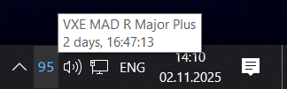

# Mouse Tray Charge

[English](README.md) | **Русский**

**Универсальный** индикатор заряда беспроводной мыши в системном трее Windows.
Одно приложение, много производителей — добавление нового вендора или модели —
это один небольшой файл, без изменений в UI и коде опроса.



## Поддерживаемые модели

- **ATK / VXE / VGN:** ATK F1 Ultimate, ATK A9 Ultimate, ATK Zero, VXE MAD R,
  VXE MAD R Major Plus, VXE R1 Pro Max, VXE R1 SE+, VGN F1 Pro
- **Zaopin:** Z2 Mini
- **Scyrox:** V8
- **Dareu:** A950 Air
- **G-Wolves:** Lycan
- **MCHOSE:** L7 Pro
- **Ninjutso:** Sora V2
- **Razer:** Viper V2 Pro, Viper V3 Pro, DeathAdder V3 Pro, DeathAdder V4 Pro,
  Basilisk V3 Pro, Basilisk V3 Pro 35K, Basilisk Ultimate, Cobra Pro, Naga Pro,
  Naga V2 Pro, Lancehead Wireless, Pro Click V2
- **Lamzu:** Maya X, Inca
- **Attack Shark:** X3
- **Logitech:** любая мышь Lightspeed/Bolt/Unifying с фичей UnifiedBattery —
  через ресивер **или при прямом подключении по USB-кабелю / Bluetooth**
  (название модели определяется автоматически по HID++) — проверено на
  PRO X2 SUPERSTRIKE (ресивер и провод)

> Драйвер Razer портирован с реализации на `pyusb` на `hidapi` ради
> единообразия; смещение в отчёте / HID-коллекцию может потребоваться уточнить
> на железе (см. примечание в [`drivers/razer.py`](mouse_tray/drivers/razer.py)).
> На реальном железе проверена только **Viper V2 Pro** — остальной список взят
> из базы устройств [OpenRazer](https://github.com/openrazer/openrazer). Это
> модели, у которых запрос батареи использует transaction id `0x1F` (именно он
> зашит в драйвере), поэтому код менять не нужно; более старые семейства Razer
> с `0x3F` / `0xFF` пока не поддержаны. Если непроверенная модель показывает
> неверно — уточните смещение ответа / `usage_page` на железе.

## Запуск из исходников

Проект управляется через [uv](https://docs.astral.sh/uv/) — быстрый менеджер
пакетов и проектов для Python: он сам создаёт виртуальное окружение и ставит
зависимости (никаких ручных `pip install` и `venv`). Поставить один раз:

```sh
# Windows (PowerShell)
powershell -c "irm https://astral.sh/uv/install.ps1 | iex"
# или через winget / pipx
winget install astral-sh.uv
```

Затем из корня проекта:

```sh
uv sync                      # создаёт .venv и ставит зависимости из uv.lock
uv run python main.py        # или:  uv run python -m mouse_tray
```

`uv run` перед запуском сам подтягивает зависимости, так что после свежего
клона достаточно одной команды `uv run python main.py`. Файл `uv.lock`
фиксирует точные версии для воспроизводимой установки.

## Сборка автономного .exe

```sh
uv run --extra build python tools/make_release.py
# -> dist/mouse_tray/
```

## Несколько мышей

Определяются все подключённые поддерживаемые мыши, а в трее показывается одна из
них. По умолчанию это первая, которая действительно ответила: приёмник с
выключенной мышью пропускается, а не показывается как «нет мыши». Выбранная так
мышь остаётся активной, пока не отключится.

Если подключено две и более, в меню трея появляется список: пункт **Auto** — то
самое поведение по умолчанию, либо можно закрепить конкретную мышь. Закрепление
строгое: если закреплённая мышь отключена, в трее `-`, а её имя показывается в
подсказке — на другую мышь индикатор молча не переключится. Выбор сохраняется в
реестре и переживает перезапуск. Опрашивается только показываемая мышь, так что
остальные ничего не стоят.

Таймер «времени с последней полной зарядки» ведётся отдельно для каждой мыши,
поэтому переключение сохраняет счётчик каждой из них.

## Настройки

Кликните по значку в трее правой кнопкой и выберите **Settings…**, чтобы из
диалога изменить интервал опроса, шрифт, цвет шрифта, окраску по уровню заряда,
вид индикатора и отладочное логирование. Изменения применяются сразу и
сохраняются в реестре (`HKCU\SOFTWARE\Mouse_Tray\Settings`), поэтому переживают
перезапуск; кнопка **Reset to defaults** возвращает значения по умолчанию.

Если включить **Color by charge level**, индикатор заряда окрашивается по уровню
заряда: выше 50% — цветом шрифта, а рядом с ним появляются ещё два выбора цвета
для нижних диапазонов — **≤ 50%** (по умолчанию жёлтый) и **≤ 20%** (по
умолчанию красный).

Если включить **Show battery icon**, вместо цифр рисуется батарейка, заполненная
на текущий процент, а точное число уходит в тултип (там же имя мыши и время с
последней полной зарядки). Состояния «нет мыши», сон и неизвестный уровень в
любом случае остаются текстовыми.

Полный набор полей (включая те, которых нет в диалоге) — в
[`mouse_tray/config.py`](mouse_tray/config.py):

| Поле               | Значение                                                   |
| ------------------ | ---------------------------------------------------------- |
| `poll_rate`        | Секунды между чтениями, когда мышь активна и разряжается   |
| `fast_poll_rate`   | Секунды между чтениями при зарядке/сне/отсутствии мыши     |
| `foreground_color` | Цвет цифр индикатора (RGB), он же цвет верхнего диапазона  |
| `dynamic_color`    | Окраска процента по уровню заряда                          |
| `mid_color`        | Цвет диапазона ≤ 50% (жёлтый)                              |
| `low_color`        | Цвет диапазона ≤ 20% (красный)                             |
| `battery_icon`     | Рисовать заполненную батарейку вместо цифр процента        |
| `background_color` | Фон значка (RGBA, по умолчанию прозрачный)                 |
| `font`             | Файл шрифта цифр (`consola.ttf`)                           |
| `app_name`         | Ключ хранилища: подраздел реестра + папка логов            |
| `display_name`     | Имя для пользователя (тултип трея, уведомления, настройки) |
| `debug`            | Подробное DEBUG-логирование (сырые HID-отчёты)            |

## Логирование

Логи пишутся в ротируемый файл `%LOCALAPPDATA%\Mouse_Tray\app.log` (1 МБ × 3
бэкапа), плюс в консоль, если она есть — у собранного оконного `.exe` консоли
нет, поэтому смотреть нужно в файл. Подробный вывод DEBUG (сырые HID-отчёты)
включается флагом `debug` в конфиге или переменной окружения
`MOUSE_TRAY_DEBUG=1`. Настройка — в
[`mouse_tray/logging_setup.py`](mouse_tray/logging_setup.py).

## Как добавить новую мышь

**Тот же вендор, новая модель** — добавьте строку в список `models` драйвера:

```python
# drivers/chipset/nordic52.py
_model("VXE NewModel", 0x373B, 0x1234, 0x5678),
```

> Драйвер `nordic52` покрывает общий **чипсет Compx/Nordic 52840**, а не только
> ATK/VXE/VGN. Многие «ноунейм»-мыши на том же кремнии (ресивер определяется как
> «Compx») заводятся одной строкой `_model` с их VID/PID — без нового драйвера.
> Zaopin Z2 Mini, Scyrox V8, Dareu A950 Air и G-Wolves Lycan добавлены именно так; если процент
> читается в байте 6 ответа на отчёт 8 — это тот самый протокол. Более новый кремний Nordic 54L15
> (ATK Zero) использует другой 64-байтный протокол и живёт в `nordic54`.

**Новый вендор** — создайте `drivers/vendor/<vendor>.py` (или
`drivers/chipset/<chip>.py`, если силикон общий для нескольких брендов),
унаследуйте `HidDriver`, перечислите модели и реализуйте `read_status()`:

```python
from ...battery import BatteryStatus
from ..driver import MouseModel, register
from ..hid import HidDriver

@register
class AcmeDriver(HidDriver):
    vendor = "Acme"
    models = [MouseModel("Acme X1", 0xABCD, 0x0001, 0x0002, usage_page=0xFF00)]

    def read_status(self) -> BatteryStatus:
        res = self._transact([0x00, ...], read_length=32, feature=True)
        if res is None:
            return BatteryStatus.absent()
        return BatteryStatus(present=True, percent=res[5], charging=bool(res[6]))
```

Затем добавьте `"vendor.acme"` в `_DRIVER_MODULES` в файле
[`drivers/__init__.py`](mouse_tray/drivers/__init__.py). Готово — детект, UI трея
и сборка подхватят драйвер автоматически.

> Большинство мышей укладываются в `HidDriver` (один запрос, фиксированные
> смещения). Многошаговые протоколы вроде Logitech HID++ наследуют
> `HidppDriver` — но возвращают тот же `BatteryStatus`, поэтому UI/реестр не
> меняются. То, что два совершенно разных транспорта подключаются к единому
> контракту `MouseDriver`, — и есть главная идея архитектуры.

## Как это работает

Любая мышь, независимо от производителя, сводится к одной нормализованной
структуре [`BatteryStatus`](mouse_tray/battery.py) — `present / percent /
charging / full / asleep`. Единый конечный автомат в
[`ui/app.py`](mouse_tray/ui/app.py) превращает её в значок трея (цифры, анимация
зарядки, уведомление о полном заряде, тултип «время с последней полной
зарядки»). Код вендора делает всего две вещи: **находит устройство** и
**разбирает его отчёт о батарее**.

```
hid.enumerate (кэш 0.5 с)  →  detect_all_drivers()  →  driver.read_status()
        bus.py                    driver.py                → BatteryStatus
                                                                 ↓
                                                _apply_status() → значок трея
```

### Шина

[`drivers/bus.py`](mouse_tray/drivers/bus.py) перечисляет всю HID-шину один раз
и кэширует снимок на 0.5 с. Детект перебирает каждую модель каждого драйвера —
десятки пар VID/PID, — поэтому сопоставление идёт в памяти, а не отдельным
сканированием шины на каждую модель. TTL заметно меньше самого быстрого
интервала опроса, так что мышь, подключённая на ходу, обнаруживается в пределах
одного тика.

### Драйверы

Контракт [`MouseDriver`](mouse_tray/drivers/driver.py) — это два метода,
`detect_all()` и `read_status()`, плюс стабильный `key` (класс драйвера +
VID/PID), опознающий мышь после переподключения. Классы регистрируются
декоратором `@register`; список модулей в
[`drivers/__init__.py`](mouse_tray/drivers/__init__.py) одновременно задаёт
импорт и порядок опроса при детекте. Ни один из методов не вправе бросать
исключение при отсутствующем устройстве или сбое ввода-вывода: ответом там
служат пустой список и `BatteryStatus.absent()`.

Под этим контрактом лежат две транспортные базы:
[`HidDriver`](mouse_tray/drivers/hid.py) для типичного случая «один запрос — один
ответ» (подклассу остаётся только `read_status()` поверх `_transact()`) и
[`HidppDriver`](mouse_tray/drivers/hidpp.py) для многошагового HID++ 2.0
(обнаружение фич, маршрутизация по индексу устройства). Общего кода у них нет —
именно поэтому настоящая абстракция здесь `MouseDriver`, а не какая-либо из баз.

### Опрос

Цикл опроса выполняется в фоновом потоке-демоне. Детект повторяется каждый тик —
он стоит одного кэшированного перечисления шины, — поэтому мышь, подключённая
позже, появляется сама, без перезапуска. Объекты драйверов переиспользуются
между проходами по `key`, поскольку кэшируют состояние конкретного устройства
(HID++-драйвер, например, узнаёт индекс устройства и индексы фич при первом
чтении). Интервал равен `poll_rate` (по умолчанию 60 с), пока мышь активна и
разряжается, и `fast_poll_rate` (1 с) в переходных состояниях — зарядка, сон,
отсутствие мыши, — где важна быстрая реакция. К виджетам рабочий поток обращается
только через `wx.CallAfter`, так что вся работа с UI остаётся в главном потоке.

### Какая мышь отображается

Обнаруживаются все подключённые мыши, читается только одна. Без закрепления
рабочий поток берёт первую, ответившую `present`, и держится за неё — поэтому
подключённый приёмник выключенной мыши не перекрывает работающую. Закрепление из
меню трея строгое: если закреплённая мышь отключена, в трее отображается `-`, а
не молчаливое переключение на другое устройство. Выбор хранится в реестре, и
рабочий поток его только *читает*, что оставляет объекты драйверов однопоточными.

### Отрисовка

[`_apply_status`](mouse_tray/ui/app.py) — плоская упорядоченная цепочка
guard-условий, по одному на состояние: нет мыши → `-`; зарядка → анимация
заливки (таймер главного потока); полный заряд → зелёный значок, уведомление и
новая отметка времени; сон → `Zzz`; мышь на связи, но уровень нечитаем → `?`;
иначе процент — цифрами или заполненной батарейкой.
[`ui/icons.py`](mouse_tray/ui/icons.py) рисует цифры средствами PIL, а батарейку
растрирует из SVG-шаблона через `wx.svg` (NanoSVG, входит в состав wxPython);
оба пути сохраняют полноценный альфа-канал вплоть до готового значка.

### Хранение

[`storage.py`](mouse_tray/storage.py) держит настройки, закреплённую мышь и
отметку времени последней полной зарядки для каждой мыши в
`HKCU\SOFTWARE\Mouse_Tray\`. Из этой отметки и вычисляется строка тултипа с
прошедшим временем.

Всю конструкцию скрепляет одно архитектурное правило: `ui/app.py` никогда не
импортирует модуль драйвера — только `detect_all_drivers()` и контракт
`MouseDriver`.

### Структура

```
mouse_tray/
  battery.py            BatteryStatus — универсальная модель статуса
  config.py             настройки (интервал опроса, цвета, шрифт)
  resources.py          пути к ресурсам, совместимые с PyInstaller
  storage.py            дата зарядки, настройки, закреплённая мышь (реестр)
  drivers/
    driver.py           MouseModel, MouseDriver, @register + реестр
    bus.py              один кэшированный снимок hid.enumerate на проход
    hid.py              HidDriver — общая база на одну транзакцию (hidapi)
    hidpp.py            HidppDriver — многошаговая база HID++ (Logitech)
    __init__.py         авто-импорт драйверов -> реестр заполняется
    chipset/            протоколы общего силикона (имя по чипсету)
      nordic52.py       Compx/Nordic 52840 (HID write/read, отчёт 8, 17 байт)
      nordic54.py       Compx/Nordic 54L15 (HID write/read, отчёт 8, 64 байта)
      realtek.py        MCHOSE / RealTek  (push-отчёт 0x13, XOR 0xFF)
    vendor/             протоколы одного бренда
      ninjutso.py       Ninjutso Sora     (HID feature-отчёт 5)
      razer.py          Razer             (HID feature-отчёт 0, OpenRazer)
      lamzu.py          Lamzu             (HID feature-отчёт, iface 2)
      logitech.py       Logitech          (HID++ 2.0 через приёмник)
      attackshark.py    Attack Shark      (входящий HID-отчёт 3, push)
  ui/
    icons.py            отрисовка значка трея (цифры PIL + SVG-батарейка)
    tray.py             обёртка над TaskBarIcon
    app.py              wx-приложение + единый автомат состояний
  icons/                встроенные .ico-ресурсы
```

## Источники протоколов и благодарности

Протокол каждого драйвера портирован из этих проектов (или сверен с ними):

- **ATK / VXE / VGN** — [Fan4Metal/ATK_tray](https://github.com/Fan4Metal/ATK_tray)
- **Ninjutso** — [Fan4Metal/Sora_tray](https://github.com/Fan4Metal/Sora_tray)
- **Razer** — [Fan4Metal/razer_tray](https://github.com/Fan4Metal/razer_tray),
  на основе [OpenRazer](https://github.com/openrazer/openrazer) и
  [rsmith-nl/scripts](https://github.com/rsmith-nl/scripts)
- **Lamzu** — [Sheroune/lamzu-battery-monitory](https://github.com/Sheroune/lamzu-battery-monitory)
- **Logitech (HID++ 2.0)** — [l2-/LogitechBatteryIndicator](https://github.com/l2-/LogitechBatteryIndicator),
  детали протокола — из [Solaar](https://github.com/pwr-Solaar/Solaar) и
  [libratbag](https://github.com/libratbag/libratbag)
- **Attack Shark** — [HarukaYamamoto0/attack-shark-x11-driver](https://github.com/HarukaYamamoto0/attack-shark-x11-driver);
  заметки по общему протоколу сообщений присланы в
  [issue #1](https://github.com/Fan4Metal/mouse_tray/issues/1)
